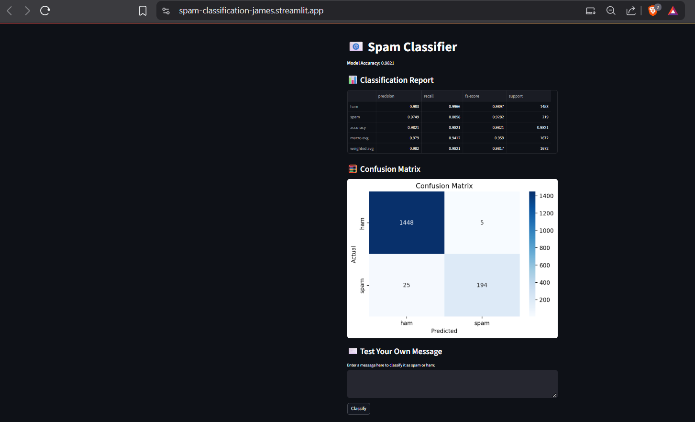

# 📧 Spam Classifier App

A simple web app built with **Streamlit** that classifies SMS messages as **Spam** or **Ham (Not Spam)** using a **Naive Bayes classifier** trained on the SMS Spam Collection dataset.

---

## 🛠️ Setup Instructions

### 1. Clone the Repository

```bash
git clone https://github.com/your-username/spam-classifier-app.git
cd spam-classifier-app
```

### 2. Create and Activate Virtual Environment (Optional)

```bash
python -m venv venv
# Windows
venv\Scripts\activate
# macOS/Linux
source venv/bin/activate
```

### 3. Install Dependencies

```bash
pip install -r requirements.txt
```

> If `requirements.txt` is not available, use:

```bash
pip install streamlit pandas scikit-learn seaborn matplotlib
```

### 4. Run the App

```bash
streamlit run app.py
```

---

## 🗼️ Screenshot


